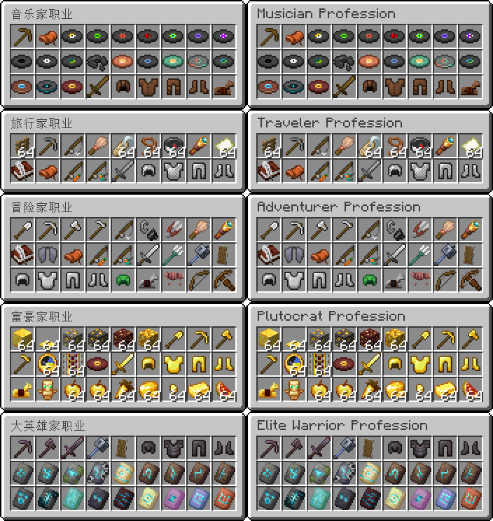

## 欢迎来到冒险生存20191124
支持中英双语。（同时显示双语）

在这里可以享受不一般的体验。与常规生存类似，但是有以下区别：
- 始终保持最高世界难度
- 无自然恢复生命
- 死亡后掉落物品
  
有地牢商城可以交易，在地牢内可付费解锁职业与附魔，也可选购恢复类物品，这之中需要很多绿宝石作为货币使用。\
所选职业的装备和工具都是无限耐久，无需担心损坏问题，切记不可分解和消耗装备与工具！\
在地牢内是相对安全的，没有敌对生物的威胁，即使你什么也不做也不会在地牢内饿死。但是不能有恶意行为。

玩家在出生点始终享有无偿增益效果，给予玩家恢复效果方便生存。离开出生点将失去增益效果，再次返回可再次恢复增益效果。

如果是第一次游玩，请选择正确的世界版本作为起始存档开始游戏。区分普通生存和极限生存！\
如果是旧世界更新，请选择对应版本的补丁按正确路径导入即可。路径如下：世界根目录:`.\generated\minecraft\structures\basic_update.nbt`\
由于Github不能上传空文件夹，因此导入补丁时需要手动创建指定路径才行。

### 更新日志

(Cbscfe: 这... 可**不是**一个更新日志啊... 可能就是这么叫的吧)
```
1.21.0~1.21.3作为起始版本开始，可共用一个世界；\
1.21.4区块变更，不能使用旧版世界开始游戏！\
1.21.5区块变更，不能使用旧版世界开始游戏！；此外命令语法变更，不能使用旧版命令，如果是旧版世界需手动导入补丁于指定位置才行！
```

---

## Wellcome to Adventure20191124!
Supports English and Chinese. (by showing both)

You can enjoy an extraordinary experience here, Similar to regular survival, but with the following gamerules: 
- difficulty hard
- no natural regeneration
- no keep inventory

There is a dungeon mall where you can pay to unlock kits and enchantments, as well purchase items,\
which require a lot of emeralds as currency.\
The equipment and tools of the chosen kit are unbreakable, so you don't have to worry about durability,\
so remember not to disassemble and consume the equipment and tools!\
It's relatively safe inside the dungeon, there is no threat from hostile mobs, and even if you do nothing,\
you won't starve to death inside the dungeon. But there can be no malicious acts.

Players always gets a free buff at the spawn point, giving the player a regeneration effect for survival.

### First Time Playing

Choose the correct version of the world as your starting save to start playing,\
and chose between Normal and Hardcore.\
If it is an old world update, please select the corresponding version of the patch and import it according to the correct path.\
The path is as follows: `.\generated\minecraft\structures\basic_update.nbt`\
Since Github can't upload empty folders, you need to manually create a specified path when importing patches.

### Update Log

(Cbscfe: well... this is NOT a update log... but I guess it's called that way)

```text
1.21.0~1.21.3 starts as the initial version, and can share a world;
1.21.4 chunk update, you can't start the game with the old world!
1.21.5 chunk update, you can't start the game with the old world!; In addition, the command syntax has been updated, you can't use the old version of the command, If it's an old world, you need to manually import the patch to the specified location!
```

---


