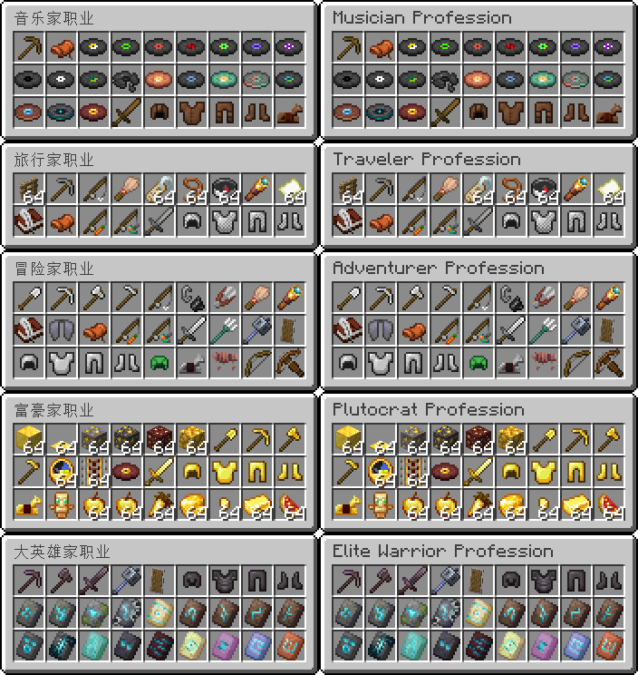

# 欢迎来到冒险生存20191124！
| 简体中文 | [English](README.md) |
| ---- | ---- |

---

支持中英双语。（同时显示双语）

在这里可以享受不一般的体验。与常规生存类似，但是有以下区别：
- 始终保持最高世界难度
- 无自然恢复生命
- 死亡后掉落物品
  
有地牢商城可以交易，在地牢内可付费解锁职业与附魔，也可选购恢复类物品，这之中需要很多绿宝石作为货币使用。\
所选职业的装备和工具都是无限耐久，无需担心损坏问题，切记不可分解和消耗装备与工具！\
在地牢内是相对安全的，没有敌对生物的威胁，即使你什么也不做也不会在地牢内饿死。但是不能有恶意行为。

玩家在出生点始终享有无偿增益效果，给予玩家恢复效果方便生存。离开出生点将失去增益效果，再次返回可再次恢复增益效果。

如果是第一次游玩，请选择正确的世界版本作为起始存档开始游戏。区分普通生存和极限生存！\
如果是旧世界更新，请选择对应版本的补丁按正确路径导入即可。路径如下：世界根目录:`.\generated\minecraft\structures\basic_update.nbt`\
由于Github不能上传空文件夹，因此导入补丁时需要手动创建指定路径才行。

### 更新日志

(Cbscfe: 这... 可**不是**一个更新日志啊... 可能就是这么叫的吧)
```
1.21.0~1.21.3作为起始版本开始，可共用一个世界；\
1.21.4区块变更，不能使用旧版世界开始游戏！\
1.21.5区块变更，不能使用旧版世界开始游戏！；此外命令语法变更，不能使用旧版命令，如果是旧版世界需手动导入补丁于指定位置才行！
```

---


